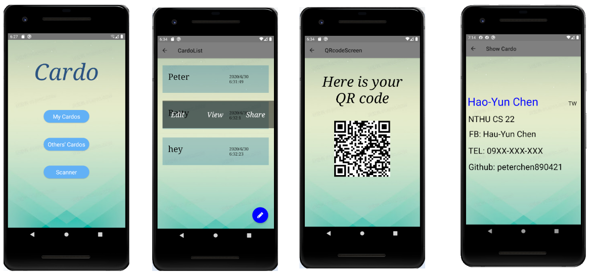

# Cardo

軟體設計實驗 Final Project

## Team Members

- [Yazmau](https://github.com/Yazmau)
- [peterchen890421](https://github.com/peterchen890421)

## Cardo 簡介
- 一個將名片 e 化的 APP
- 使用者可以用 APP 來製作自己的名片
- 透過 QR code 掃描可以下載別人的名片
- 查看名片時可以快速開啟連結（例如 Facebook 個人檔案）

## Cardo 已實現功能
- 編輯、新增和刪除自己的 Cardo 
- 編輯模式下可加入文字方塊並拖曳、更改文字顏色和大小、加入連結
- 儲存、瀏覽自己和別人的 Cardo ，並可產生 QR code
- 透過 App 內的相機掃描 QR code 下載別人的名片
- 查看名片時可以快速開啟連結（例如 Facebook 個人檔案）

## TODO
- 名片清單下實現更多方便功能（例如群組功能）
- 製作名片上提供更多特色、方便使用者設計名片
- 提供文字方塊更多屬性
- 更多的可用物件
- 輔助編輯功能（背景渲染網格，拖曳方塊時會貼齊格線）
- 匯入普通名片（圖片）並套用連結功能
- 初次開啟 APP 時有操作教學
- UI 美化 _(´ཀ`」 ∠)_ 
